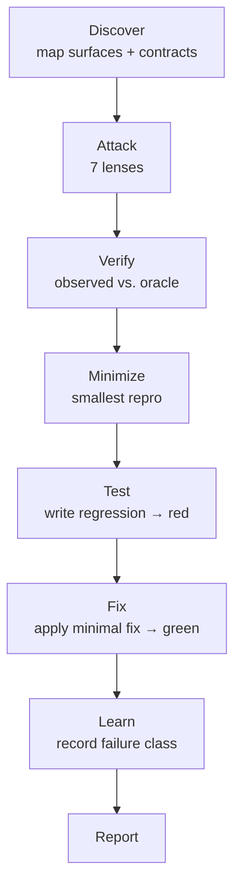

# sstack

> This one goes looking for the not-happy test cases, the ones
> nobody writes tests for on purpose:
>
> - the empty string
> - the `null`
> - the duplicate webhook
> - the dependency that dies at 2am
> - the second request that lands while the first is still running

**sad stack** · negative testing for AI coding agents

gstack, pstack, sstack. Same suffix, same shape: a `SKILL.md` your
agent reads, a directory you copy in, a slash command you type. The
family ships features and reviews diffs. sstack finds the ways your
software fails, writes a test for each one that fails today, and
applies the minimal fix that turns it green.

> Don't ask whether the software is robust.
> Exercise the failure condition, write the test that proves it, and
> fix it.

## The not-happy cases, staged



The oracle is written *before* the attack. "It crashes" isn't an
expectation; "it raises a validation error naming the field" is. A
test that passes against code you just proved broken has pinned the
bug, and a pinned bug is worse than no test at all.

## Install

```bash
npx skills@latest add mhenke/sstack
```

That installs the skills. It leaves out the seven
`agents/sstack-*-attacker.md` files, which `npx skills add` does not
carry; the install prompt below covers those. It also registers
`/sstack` in Claude Code only. Cursor, Windsurf, Codex, and the rest
have no command to install: open the skill directory in your editor
and ask for it in your own words.

### Attacker agent install prompt

Paste into your agent:

```text
Copy the seven agents/*.md files from https://github.com/mhenke/sstack into ~/.agents/agents/ (the .agents Protocol hub; create it if missing), plus a VS Code copy in ~/.copilot/agents/ renamed <name>.agent.md.
```

Claude Code: also copy them to `~/.claude/agents/`. Per-repo VS Code:
`.github/agents/`.

### Running it

The command takes what to test. In Claude Code:

```text
/sstack src/checkout.ts
```

The argument is the scope: a file, a directory, a module, a package,
or a URL. sstack reads that scope, maps the surfaces inside it, and
works only within what you named. A narrow scope keeps the run small;
a directory keeps it broad.

In an agent without slash commands, say the same thing in a prompt:
"use the sstack skill on src/checkout.ts".

No CLI, no daemon, no binary, nothing to install. The pack is
Markdown plus one stdlib-only Python script the agent runs to write
its own evidence; where Python is absent, the same evidence is two
shell commands (see [Evidence](#evidence)).

### Customizing

Everything sstack does is customizable the same way: drop a file in
your own tree with an `sstack-` prefix, and the next run picks it up.
No config to edit, no plugin to install, and nothing of ours to
modify.

```
<your-repo>/.agents/skills/     your lenses and stage rules
<your-repo>/.agents/agents/     your attackers
~/.agents/skills/               same, for every repo you run
~/.agents/agents/
```

Project wins over global, the way OpenCode, Claude Code, and VS Code
already resolve skills. Keep your files out of `skills/` and
`agents/`, the directories this pack ships: those are replaced
wholesale when you update, so anything you put there is lost.

| to add | drop | named |
|---|---|---|
| an attack angle | `.agents/skills/sstack-<lens>/SKILL.md` | `sstack-ordering` |
| a worker | `.agents/agents/sstack-<lens>-attacker.md` | `sstack-ordering-attacker` |
| rules for a stage | `.agents/skills/sstack-<stage>-<what>/SKILL.md` | `sstack-test-conventions` |

The `sstack-` prefix is the whole contract. A file without it is
none of sstack's business.

A lens is a skill, so it is an ordinary `SKILL.md`:

```markdown
---
name: sstack-ordering
description: Operations applied out of sequence.
applies-when: two operations on one resource
disable-model-invocation: true
---

# Ordering lens rubric

Case-generation heuristics, oracle patterns, worked examples, and
when-not-to-apply guidance.
```

`disable-model-invocation: true` matters: a lens is pasted into an
attack dispatch by sstack, never auto-loaded by your tool matching its
description, because a rubric with no target yet means nothing.

`<lens>` becomes a filename under `.sstack/findings/`, so keep it to
letters, digits, dot, dash, and underscore. `applies-when` is
optional: it narrows the lens to surfaces it is for, and without it
the lens runs on every mapped surface.

Your lens needs no agent. It runs on a shipped attacker whose
discipline fits, with your rubric appended after the built-in one, so
it widens coverage rather than replacing it. Add an agent only when
the worker itself must behave differently.

To skip a shipped lens for one run, name it in the chat or put
`lenses.remove: ownership` in `.sstack/config.md`. Skips are reported
in the summary, because a quietly weakened run reads as a clean one.

### The three words

**Stages** are the process, and there are always seven:

```
Discover → Attack → Verify → Minimize → Test → Fix → Learn
```

**Lenses** are what you attack with. Seven ship: `boundaries`,
`malformed`, `missing`, `ownership`, `exceptional-conditions`,
`resource-exhaustion`, `state`. Only Attack uses them, against every
surface Discover found. How many cases run is surface × lens, and
neither factor has a ceiling.

**Agents** are who does the attacking: one subprocess per shipped
lens, receiving the surface map, its rubric, and the report format in
its message. A lens and its agent ship paired, which is why they read
as one thing. They are not: the lens is the strategy, the agent is
the worker.

### For contributors

`docs/`, `evals/`, and the acceptance record live only in a git
checkout: they are the contributor lane, the place the evidence
gets produced and audited.

### Optional lifecycle skills

Install only the skills sstack uses across its lifecycle:

```bash
npx skills@latest add cursor/plugins \
  --skill principle-attack-the-premise \
  --skill create-verification-skill \
  --skill maintain-verification-skill \
  --skill principle-test-behavior-not-implementation \
  --skill principle-fix-root-causes \
  --global -y
```

`-y` answers the interactive agent picker. Without it, a non-TTY
run prints "Nothing was installed" and exits 0.

Lifecycle mapping:

- Discover → `principle-foundational-thinking`, `principle-model-the-domain`, `principle-exhaust-the-design-space`, `create-verification-skill`, `maintain-verification-skill`
- Attack → `principle-attack-the-premise`, `principle-boundary-discipline`, `principle-exhaust-the-design-space`
- Verify → `principle-prove-it-works`, `principle-outcome-oriented-execution`
- Minimize → `principle-minimize-reader-load`, `principle-sequence-verifiable-units`
- Test → `principle-test-behavior-not-implementation`, `principle-encode-lessons-in-structure`
- Fix → `principle-fix-root-causes`, `principle-subtract-before-you-add`, `principle-type-system-discipline`
- Run-end → `principle-prove-it-works`, `principle-outcome-oriented-execution`, `principle-guard-the-context-window`

All are optional. If they are not installed, sstack falls back to its
built-in prose and the target's documentation, types, and call sites.

## Evidence

Every finding carries a fingerprint of the output it was judged on:
the first 16 hex characters of `sha256(stdout + stderr)`. The
`replay` auditor recomputes it from the recorded bytes, so a
fingerprint that could not have come from that output is detectable.

Where Python is available, the shipped script does the whole thing:
it runs the repro, captures the output, hashes it, writes the
finding, and rebuilds the report.

```bash
echo "$FINDING_JSON" | python3 skills/sstack/scripts/emit_findings.py \
  --workspace "$(pwd)" --fixture my-fixture
```

Where Python is absent, two shell commands produce the same evidence:

```bash
"$REPRO" > o.txt 2> e.txt; code=$?
fp=$(cat o.txt e.txt | sha256sum | cut -c1-16)   # macOS: shasum -a 256
```

Write the streams to files. A `$(...)` substitution strips trailing
newlines, so the hash would cover different bytes than the evidence
records, and every fingerprint would read as fabricated.


## Languages

The process is language-agnostic. The evidence is not. Python,
TypeScript, JavaScript, Java, and C++ each have a seeded repo under
`evals/` with a happy-path baseline, and the table below shows how
far each one has been carried.

## What it leaves behind

```
.sstack/
├── config.md     lenses.remove only, if you skip one (optional)
├── map.md        surfaces + assumed contracts
├── plan.md       lenses, cases, oracles
├── learn/        failure classes for the next run
├── findings/     one .md and one .json per finding
└── scratch/      throwaway attack scripts (gone at run end)
```

That directory is created in your repo, on your machine, the first
time you run `/sstack`. The pack you installed is only `skills/` and
`agents/`; nothing from the sstack repository comes with it. Your own
lenses live in `.agents/`, next to your code, where git already
tracks them. Everything in `.sstack/` is run output, so ignore it.

Plus regression tests and fixes. Tests land in your suite; fixes land
in your source, scoped to the minimal change that satisfies the
oracle. Config and secrets stay read-only.

## Is it actually any good?

The eval is a cold agent with no memory, no answer key, and the
current skills plus agents:

```bash
python3 evals/acceptance.py prepare seeded-py
```

It hands back a temp workspace with a deliberately broken repo and
nothing else. Start a fresh agent session with no memory of this
repository, point it at that directory, and let it work:

```bash
python3 evals/acceptance.py grade path/to/workspace
```

`prepare-all` creates workspaces for all five fixtures. `grade`
matches findings to the answer key by content, not by the labels an
agent guesses; `replay` re-audits each finding's evidence file with
the agent out of the loop. The entry point never launches an agent or
reads `BUGS.md`; cold-agent dispatch stays outside the repository.

| Fixture | Seeds | Current cold evidence |
|---|---|---|
| seeded-py | 7 | PASS; 5/5 matched (ColdPy-5, state seed included), 12/12 replay intact, 0 drift. The ownership seed has not had a full cold pass |
| seeded-ts | 5 | PASS; 5/5 seeds content-matched, 19/19 evidence replay intact (rerun) |
| seeded-js | 5 | PASS; 5/5 seeds content-matched, 12/12 evidence replay intact (rerun) |
| seeded-java | 5 | PASS; 3/5 seeds content-matched, 7/7 evidence replay intact (rerun on current text) |
| seeded-cpp | 5 | PASS; 3/5 seeds content-matched, 13/13 evidence replay intact (rerun) |

Each row is the most recent cold pass for that fixture, and only the
seeded-py one has been re-run since the current lens set landed.
Earlier waves' failures, including fabricated fingerprints and
regressions that never landed, are in the run histories.

Full record, including the runs that failed and what each one taught
the skill: [`evals/ACCEPTANCE.md`](evals/ACCEPTANCE.md).

## Docs

- [`docs/ETHOS.md`](docs/ETHOS.md): the four rules
- [`docs/ARCHITECTURE.md`](docs/ARCHITECTURE.md): lifecycle, the eight
  definitions, the 15-lens taxonomy, what v1 adds
- [`docs/CUSTOMIZING.md`](docs/CUSTOMIZING.md): adding a lens, an
  agent, or stage rules
- [`docs/TOOLS.md`](docs/TOOLS.md): negative-testing tools by language
- [`docs/RESEARCH.md`](docs/RESEARCH.md): the research behind the
  decisions, and what is still open
