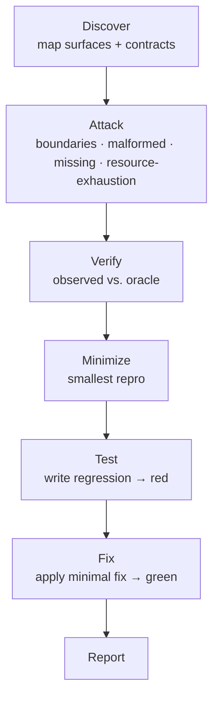

# sstack

**sad stack** · negative testing for AI coding agents

gstack, pstack, sstack. Same suffix, same shape: a `SKILL.md` your
agent reads, a directory you copy in, a slash command you type. The
family ships features and reviews diffs. This one goes looking for
the not-happy test cases, the ones nobody writes tests for on
purpose:

- the empty string
- the `null`
- the duplicate webhook
- the dependency that dies at 2am
- the second request that lands while the first is still running

It finds the ways your software fails, writes a test for each one
that fails today, and applies the minimal fix that turns it green.

> Don't ask whether the software is robust.
> Exercise the failure condition, write the test that proves it, and
> fix it.

## The not-happy cases, staged



The oracle is written *before* the attack. "It crashes" isn't an
expectation; "it raises a validation error naming the field" is. A
test that passes against code you just proved broken has pinned the
bug, and a pinned bug is worse than no test at all.

## Install

```bash
npx skills@latest add mhenke/sstack
```

Then:

```
/sstack src/checkout.ts
```

Zero runtime. No CLI, no daemon, no binary. It is Markdown, and it
runs wherever your agent already does.

## Languages

The process is language-agnostic. The evidence is not.

**Supported fixture coverage** - Python, TypeScript, JavaScript, Java,
and C++. Each has a seeded repo under `evals/` and a happy-path
baseline. Only Python and TypeScript have recorded cold-run
acceptance; the other three are baseline coverage, not proof.

The lifecycle is language-independent. JavaScript, Java, and C++
remain unproven for cold-agent acceptance until their runs are
recorded. `ROADMAP.md` tracks that gap.

## What it leaves behind

```
.sstack/
├── map.md        surfaces + assumed contracts
├── plan.md       lenses, cases, oracles
├── findings/     one per finding: case, oracle, observed,
│                 verdict, repro, regression
└── scratch/      throwaway attack scripts (gone at run end)
```

Plus regression tests and fixes. Tests land in your suite; fixes land
in your source, scoped to the minimal change that satisfies the
oracle. Config and secrets stay read-only.

## Is it actually any good?

The eval is a cold agent with no memory, no answer key, one copy of
the skill:

```bash
python3 evals/acceptance.py prepare seeded-py
```

It hands back a temp workspace with a deliberately broken repo and
nothing else. Launch your host's cold agent in that directory, then:

```bash
python3 evals/acceptance.py grade path/to/report.json
```

`prepare-all` creates workspaces for all five fixtures. The entry point
never launches an agent or reads `BUGS.md`; host-specific cold-agent
dispatch stays outside the repository.
| | seeded-py | seeded-ts |
|---|---|---|
| Bugs planted | 5 | 5 |
| Bugs found | 4 | 5 |
| Regression tests failing on the bug | 9 | 22 |
| Still failing after the fix | 0 | 1 * |

\* one test asserted a single branch of a two-branch oracle, which
was the run's test writing rather than the code.

The TypeScript run turned up a bug nobody planted: `Math.max(...arr)`
overflows the call stack on a large but legitimate array. It is not
in the answer key.

Full record, including the runs that failed and what each one taught
the skill: [`evals/ACCEPTANCE.md`](evals/ACCEPTANCE.md).

Those numbers are from a run before the last two rounds of guardrail
fixes. The skill text has changed since; re-running is the only way to
refresh them.

## Docs

- [`docs/ETHOS.md`](docs/ETHOS.md): the four rules
- [`docs/ARCHITECTURE.md`](docs/ARCHITECTURE.md): lifecycle, the six
  definitions, the 15-lens taxonomy, what v1 adds
- [`docs/adr/`](docs/adr/README.md): decision records
- [`docs/TOOLS.md`](docs/TOOLS.md): negative-testing tools by language
- [`docs/RESEARCH.md`](docs/RESEARCH.md): the research behind the
  decisions, and what is still open
