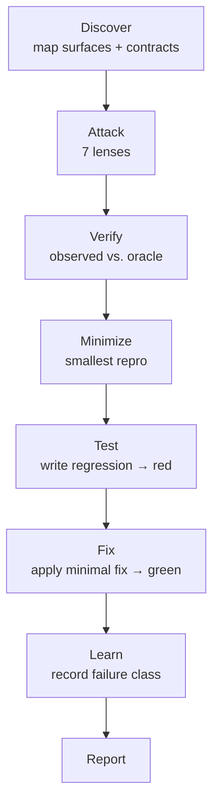

# sstack

> This one goes looking for the not-happy test cases, the ones
> nobody writes tests for on purpose:
>
> - the empty string
> - the `null`
> - the duplicate webhook
> - the dependency that dies at 2am
> - the second request that lands while the first is still running

**sad stack** · negative testing for AI coding agents

gstack, pstack, sstack. Same suffix, same shape: a `SKILL.md` your
agent reads, a directory you copy in, a slash command you type. The
family ships features and reviews diffs. sstack finds the ways your
software fails, writes a test for each one that fails today, and
applies the minimal fix that turns it green.

> Don't ask whether the software is robust.
> Exercise the failure condition, write the test that proves it, and
> fix it.

## The not-happy cases, staged



The oracle is written *before* the attack. "It crashes" isn't an
expectation; "it raises a validation error naming the field" is. A
test that passes against code you just proved broken has pinned the
bug, and a pinned bug is worse than no test at all.

## Install

```bash
npx skills@latest add mhenke/sstack
```

That installs the skills. It leaves out the seven
`agents/sstack-*-attacker.md` files, which `npx skills add` does not
carry; the install prompt below covers those. It also registers
`/sstack` in Claude Code only. Cursor, Windsurf, Codex, and the rest
have no command to install: open the skill directory in your editor
and ask for it in your own words.

### Attacker agent install prompt

Paste into your agent:

```text
Copy the seven agents/*.md files from https://github.com/mhenke/sstack into ~/.agents/agents/ (the .agents Protocol hub; create it if missing), plus a VS Code copy in ~/.copilot/agents/ renamed <name>.agent.md.
```

Claude Code: also copy them to `~/.claude/agents/`. Per-repo VS Code:
`.github/agents/`.

### Running it

The command takes what to test. In Claude Code:

```text
/sstack src/checkout.ts
```

The argument is the scope: a file, a directory, a module, a package,
or a URL. sstack reads that scope, maps the surfaces inside it, and
works only within what you named. A narrow scope keeps the run small;
a directory keeps it broad.

In an agent without slash commands, say the same thing in a prompt:
"use the sstack skill on src/checkout.ts".

Nothing to install. The agent reads the skills and runs the pack's
emitter (`skills/sstack/scripts/emit_findings.py`); where
Python is absent, two shell commands produce the same evidence:

```bash
"$REPRO" > o.txt 2> e.txt; code=$?
fp=$(cat o.txt e.txt | sha256sum | cut -c1-16)   # macOS: shasum -a 256
```

Write the streams to files: a `$(...)` substitution strips trailing
newlines, so the hash would cover different bytes than the evidence
records.

### Customizing

Drop a file in your own tree with an `sstack-` prefix — a lens in a
skills dir, a worker in an agents dir — and the next run picks it up.
Keep your files out of the shipped `skills/` and `agents/`
directories: updates replace them wholesale, so anything you put
there is lost. Full reference:
[`docs/CUSTOMIZING.md`](docs/CUSTOMIZING.md).

### For contributors

`docs/`, `evals/`, and the acceptance record live only in a git
checkout: they are the contributor lane, the place the evidence
gets produced and audited.

### Optional lifecycle skills

Install only the skills sstack uses across its lifecycle:

```bash
npx skills@latest add cursor/plugins \
  --skill principle-attack-the-premise \
  --skill create-verification-skill \
  --skill maintain-verification-skill \
  --skill principle-test-behavior-not-implementation \
  --skill principle-fix-root-causes \
  --global -y
```

`-y` answers the interactive agent picker. Without it, a non-TTY
run prints "Nothing was installed" and exits 0.

All are optional. If they are not installed, sstack falls back to its
built-in prose and the target's documentation, types, and call sites.

## What it leaves behind

```
.sstack/
├── config.md     lenses.remove only, if you skip one (optional)
├── map.md        surfaces + assumed contracts
├── plan.md       lenses, cases, oracles
├── learn/        failure classes for the next run
├── findings/     one .md and one .json per finding
└── scratch/      throwaway attack scripts (gone at run end)
```

That directory is created in your repo, on your machine, the first
time you run `/sstack`. The pack you installed is only `skills/` and
`agents/`; nothing from the sstack repository comes with it. Your own
lenses live in `.agents/`, next to your code, where git already
tracks them. Everything in `.sstack/` is run output, so ignore it.

Plus regression tests and fixes. Tests land in your suite; fixes land
in your source, scoped to the minimal change that satisfies the
oracle. Config and secrets stay read-only.

## Is it actually any good?

The eval is a cold agent with no memory, no answer key, and the
current skills plus agents. How to run it:
[`evals/README.md`](evals/README.md).

`grade` matches findings to the answer key by content, not by the
labels an agent guesses; `replay` re-audits each finding's evidence
file with the agent out of the loop.

| Fixture | Seeds | Current cold evidence |
|---|---|---|
| seeded-py | 7 | PASS; 5/5 matched (ColdPy-5, state seed included), 12/12 replay intact, 0 drift. The ownership seed has not had a full cold pass |
| seeded-ts | 5 | PASS; 5/5 seeds content-matched, 19/19 evidence replay intact (rerun) |
| seeded-js | 5 | PASS; 5/5 seeds content-matched, 12/12 evidence replay intact (rerun) |
| seeded-java | 5 | PASS; 3/5 seeds content-matched, 7/7 evidence replay intact (rerun on current text) |
| seeded-cpp | 5 | PASS; 3/5 seeds content-matched, 13/13 evidence replay intact (rerun) |

Each row is the most recent cold pass for that fixture, and only the
seeded-py one has been re-run since the current lens set landed.
Earlier waves' failures, including fabricated fingerprints and
regressions that never landed, are in the run histories.

Full record, including the runs that failed and what each one taught
the skill: [`evals/ACCEPTANCE.md`](evals/ACCEPTANCE.md).

## What's new

[v0.2.0](https://github.com/mhenke/sstack/releases/tag/v0.2.0)
(2026-09-26): seven lenses (ownership, exceptional-conditions,
resource-exhaustion, and state join the original three), per-lens
attacker agents, user customization via the `sstack-` prefix, a
shipped evidence emitter with machine-replayable findings, and cold
acceptance PASS on all five fixtures.

Full changelog: [`CHANGELOG.md`](CHANGELOG.md).

## Docs

- [`docs/ARCHITECTURE.md`](docs/ARCHITECTURE.md): what the pack is —
  the eight product nouns, lifecycle stages, lens taxonomy, v0 scope
- [`CONTEXT.md`](CONTEXT.md): what the words mean — judging
  vocabulary for the eval harness and evidence contract
- [`docs/ETHOS.md`](docs/ETHOS.md): the four rules
- [`docs/CUSTOMIZING.md`](docs/CUSTOMIZING.md): adding a lens or an
  agent
- [`docs/TOOLS.md`](docs/TOOLS.md): negative-testing tools by language
- [`docs/RESEARCH.md`](docs/RESEARCH.md): the research behind the
  decisions, and what is still open
