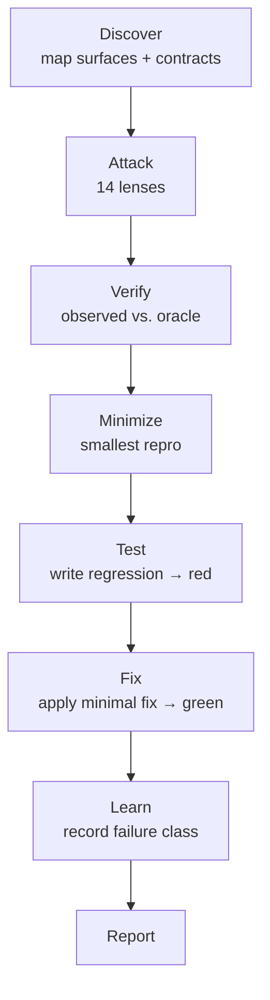

# sstack

> This one goes looking for the not-happy test cases, the ones
> nobody writes tests for on purpose:
>
> - the empty string
> - the `null`
> - the duplicate webhook
> - the dependency that dies at 2am
> - the second request that lands while the first is still running

**sad stack** · negative testing for AI coding agents

[gstack](https://github.com/garrytan/gstack), pstack, sstack. Same suffix, same shape: a `SKILL.md` your
agent reads, a directory you copy in, a slash command you type. The
family ships features and reviews diffs. sstack finds the ways your
software fails, writes a test for each one that fails today, and
applies the minimal fix that turns it green.

> Don't ask whether the software is robust.
> Exercise the failure condition, write the test that proves it, and
> fix it.

Live site: <https://mhenke.github.io/sstack/>

## The not-happy cases, staged


```mermaid
flowchart TD
    D["Discover\nmap surfaces + contracts"] --> A["Attack\n14 lenses"]
    A --> V["Verify\nobserved vs. oracle"]
    V --> M["Minimize\nsmallest repro"]
    M --> T["Test\nwrite regression → red"]
    T --> F["Fix\napply minimal fix → green"]
    F --> L["Learn\nrecord failure class"]
    L --> R["Report"]
```

> **Oracle** — the expected behavior written down *before* the attack:
> error, degradation, retry bound, invariant, rejection — not only
> crashes. "It crashes" isn't an expectation; "it raises a validation
> error naming the field" is. A test that passes against code you just
> proved broken has pinned the bug, and a pinned bug is worse than no
> test at all.

## Install

Two installs, equal weight: the skills (the strategy) and the attacker
agents (the workers).

### Install the skills

```bash
npx skills@latest add mhenke/sstack
```

That installs the skills and registers `/sstack` in Claude Code only.
Cursor, Windsurf, Codex, and the rest have no command to install: open
the skill directory in your editor and ask for it in your own words.

### Install the attacker agents

`npx skills add` does not carry these — every host keeps agents in its
own directory, so pick your row and copy the `agents/*.md` files
there:


| host | copy to | extension |
|---|---|---|
| Agnostic (`.agents` hub) | `~/.agents/` or `.agents/` | `.md` |
| Claude Code | `~/.claude/agents/` (all repos) or `.claude/agents/` (this repo) | `.md` |
| VS Code / Copilot | `~/.copilot/agents/` (all repos) or `.github/agents/` (this repo) | `.agent.md` |
| Cursor, Windsurf, Codex, others | their own agents directory | `.md` |

Global (`~`) is available in every repo you open; per-repo (`.`) travels
with the code and reaches a teammate by commit. Create the directory if
it is missing.

The portable one-paste version, for an AI CLI or IDE — paste it into
your agent and it does the copying:

```text
Copy the agents/*.md files from https://github.com/mhenke/sstack into ~/.agents/ (create it if missing), overwriting files already there.
```

For VS Code:

```text
Copy the agents/*.md files from https://github.com/mhenke/sstack into ~/.copilot/agents/ renamed <name>.agent.md.
```

Only VS Code needs the rename; every other host reads the files as-is.

Re-paste the prompt after an upstream update — it overwrites, which is
the update. If an agent you installed earlier has since disappeared
from the repo, the leftover file is harmless: no lens dispatches it,
and every run reports it by name as an unused customization. Delete it
when you see the report. Never let an update touch other `sstack-*`
files in that directory — files you authored there are your own
customizations, and the update's glob only covers the shipped names.


### Running it

The command takes what to test. In Claude Code:

```text
/sstack src/checkout.ts
```

The argument is the scope: a file, a directory, a module, or a
package. sstack reads that scope, maps the surfaces inside it, and
works only within what you named. A narrow scope keeps the run small;
a directory keeps it broad.

> **Harden** — `/sstack harden <scope>` runs the same lifecycle in
> gap-filling mode: it measures what the suite's negative tests already
> cover and writes the missing ones. A harden test that comes back red
> is a live bug and flips into the lifecycle; the rest land as
> hardening tests.
>
> **Triage** — `/sstack triage <scope>` runs churn-ranked surface heat
> before a full Discover: it ranks target surfaces by git touch
> frequency, `learn/` adjacency, and impact class to focus the attack
> without shrinking the whole-target map.

In an agent without slash commands, say the same thing in a prompt:
"use the sstack skill on src/checkout.ts".

Nothing to install. The agent reads the skills and runs the pack's
emitter (`skills/sstack/scripts/emit_findings.py`, with `emit_findings.js`
as the fallback under Node). Both are stdlib-only reference scripts that
execute the repro, capture output, compute the SHA256 fingerprint, and
write findings plus `report.json` — and refuse to record anything if a
referenced scratch probe does not compile.

### Customizing

Drop a file in your own tree with an `sstack-` prefix — a lens in a
skills dir, a worker in an agents dir — and the next run picks it up.
Keep your files out of the shipped `skills/` and `agents/`
directories: updates replace them wholesale, so anything you put
there is lost. Full reference:
[`docs/CUSTOMIZING.md`](docs/CUSTOMIZING.md).

### For contributors

`docs/`, `evals/`, and the acceptance record live only in a git
checkout: they are the contributor lane, the place the evidence
gets produced and audited.

### Optional lifecycle skills

Install only the skills sstack uses across its lifecycle:

```bash
npx skills@latest add cursor/plugins --skill principle-attack-the-premise --skill create-verification-skill --skill maintain-verification-skill --skill principle-test-behavior-not-implementation --skill principle-fix-root-causes --global -y
```

`-y` answers the interactive agent picker. Without it, a non-TTY
run prints "Nothing was installed" and exits 0.

All are optional. If they are not installed, sstack falls back to its
built-in prose and the target's documentation, types, and call sites.

## What it leaves behind

```
.sstack/
├── config.md     lenses.remove only, if you skip one (optional)
├── map.md        surfaces, assumed contracts, selected + skipped lenses
├── plan.md       lenses, cases, oracles
├── learn/        failure classes for the next run
├── findings/     one .md and one .json per finding
└── scratch/      throwaway attack scripts (gone at run end)
```

That directory is created in your repo, on your machine, the first
time you run `/sstack`. The pack you installed is only `skills/` and
`agents/`; nothing from the sstack repository comes with it. Your own
lenses live in `.agents/`, next to your code, where git already
tracks them. Everything in `.sstack/` is run output, so ignore it.

Plus regression tests and fixes. Tests land in your suite; fixes land
in your source, scoped to the minimal change that satisfies the
oracle. Config and secrets stay read-only.

## Is it actually any good?

The eval is a cold agent with no memory, no answer key, and the
current skills plus agents. How to run it:
[`evals/README.md`](evals/README.md).

`grade` matches findings to the answer key by content, not by the
labels an agent guesses, and gates a pass on evidence integrity;
`replay` re-audits each finding's evidence file with the agent out of
the loop.

| Fixture | Seeds | Current cold evidence |
|---|---|---|
| seeded-py | 19 | PASS; ColdEvalPy-Reset (2026-10-04) verified 15 confirmed red→green regressions in tests/test_shop.py, 2 hardening tests, 22/22 suite green, 17/17 replay intact, `grade` pass: true. Seeds 17–19 verified (ColdRequestMode py-17/py-19; ColdEvalPy-Reset py-17/py-18). Baseline: `evals/baseline-cold-eval-py.json`. |
| seeded-ts | 19 | PASS; ColdEvalTs-Reset (2026-10-04) verified 16 confirmed red→green regressions in tests/shop.test.ts, 22/22 suite green in vitest, 16/16 replay intact, `grade` pass: true, content-matched seeds including ts-17. Baseline: `evals/baseline-cold-eval-ts.json`. |
| seeded-js | 19 | PASS; ColdEvalJs-2026-10-04 verified 14 confirmed findings, 14 red→green regressions landed, 0 drift, `grade` pass: true, content-matched seeds including js-17. Baseline: `evals/baseline-cold-eval-js.json`. |
| seeded-java | 19 | PASS; ColdEvalJava-2026-10-04 verified 14 confirmed findings, 14 red→green regressions landed in ShopTest.java, 0 drift, `grade` pass: true, content-matched seeds including java-17 and java-19. Baseline: `evals/baseline-cold-eval-java.json`. |
| seeded-cpp | 19 | PASS; ColdEvalCpp-2026-10-04 verified 14 confirmed findings, 14 red→green regressions landed in tests/shop_test.cpp, 0 drift, `grade` pass: true, content-matched seeds including cpp-17, cpp-18, cpp-19. Baseline: `evals/baseline-cold-eval-cpp.json`. |

All five fixtures (`seeded-py`, `seeded-ts`, `seeded-js`, `seeded-java`, and `seeded-cpp`) are re-run on the current 14-lens set. Earlier waves' failures, including
fabricated fingerprints and regressions that never landed, are in the
run histories.

Full record, including the runs that failed and what each one taught
the skill: [`evals/ACCEPTANCE.md`](evals/ACCEPTANCE.md).

## What's new

v0.5.1 (2026-10-04): 5/5 cold evaluation baselines verified across all five
supported languages (`seeded-py`, `seeded-ts`, `seeded-js`, `seeded-cpp`,
`seeded-java`) covering seeds `*-17` through `*-19`; bounded concurrency and
serial execution controls in `acceptance.py eval`; emitter schema normalization
for `command` vs `repro` and shorthand fixture aliases; safety filter false
positive neutralization in security rubrics; root-cause principles codified
across evals, ethos, and routing.

v0.5.0 (2026-10-04): `/sstack triage <target>` pre-lifecycle subcommand
(churn heat, friction walk, priority ranking without whole-target map
shrinkage); emitter `--upgrade` flag and non-blocking stdin handling;
target scope authority anchored to code diffs rather than terminal
history; architectural reset back to first principles with cold eval
PASS on `seeded-py`.

Full changelog: [`CHANGELOG.md`](CHANGELOG.md).

## Docs

- [`docs/ARCHITECTURE.md`](docs/ARCHITECTURE.md): what the pack is —
  the eight product nouns, lifecycle stages, lens taxonomy, v0 scope
- [`CONTEXT.md`](CONTEXT.md): what the words mean — judging
  vocabulary for the eval harness and evidence contract
- [`docs/ETHOS.md`](docs/ETHOS.md): the four rules
- [`docs/CUSTOMIZING.md`](docs/CUSTOMIZING.md): adding a lens or an
  agent
- [`docs/TOOLS.md`](docs/TOOLS.md): negative-testing tools by language
- [`docs/research/RESEARCH.md`](docs/research/RESEARCH.md): the research
  behind the decisions, and what is still open
